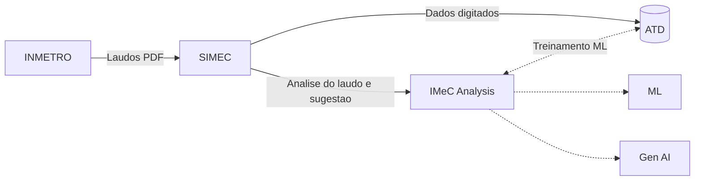

# Faturamento - Cobrança: Experimentação

#  IMeC Analysis
Inspeção de Medidor de Consumo baseado em laudos analíticos do INMETRO.

### Proposta e execução
> Thiago de Souza Vieira <br>
> Thiago Rodrigues e Rodrigues

## Objetivo
Automatizar a análise de laudos técnicos de aferição (disponibilizados via link como imagem/PDF), permitindo que um modelo de Inteligência Artificial classifique o resultado dentro de opções pré-definidas e cadastradas no sistema. 

O valor gerado está diretamente associado ao aumento da assertividade nos resultados de aferição reportados, potencializando a precisão no cálculo da recuperação de consumo automatizado. 

Registros incorretos desses resultados expõem a operação ao risco de validação de cálculos com critérios inadequados, além de demandarem retrabalho para ajustes, impactando negativamente a eficiência operacional e a confiabilidade do processo.

## Preparação e classificação

O pacote [src/machine_learning](src/machine_learning) agora separa três etapas:

- [src/machine_learning/feature_engineering.py](src/machine_learning/feature_engineering.py): perfilamento do dataset e recomendações heurísticas de colunas.
- [src/machine_learning/data_preparation.py](src/machine_learning/data_preparation.py): limpeza, imputação, encoding, scaling, redução de dimensionalidade e persistência dos artefatos de pré-processamento.
- [src/machine_learning/classification](src/machine_learning/classification): treino sequencial dos classificadores do pipeline padrão — **CatBoost e XGBoost** — com cálculo e consolidação de métricas. k-NN e SVM continuam implementados em [`models.py`](src/machine_learning/classification/models.py) (`build_classifier_registry`) para uso experimental/comparativo, mas foram descontinuados do fluxo padrão (`DEFAULT_CLASSIFIER_ORDER`) por apresentarem desempenho inferior nesse problema; podem ser reativados informando `algorithm_order` em `ClassificationConfig`.

Durante a preparação, o pipeline também gera artefatos de data exploration em [model/exploration](model/exploration):

- histogramas das features numéricas em PNG e HTML
- gráficos de dispersão ou distribuição por target em PNG e HTML
- matriz de correlação em PNG e HTML
- metadata JSON com colunas consideradas e arquivos emitidos

Exemplo de execução local:

```powershell
python src/machine_learning/feature_engineering.py
python src/machine_learning/data_preparation.py
python src/main.py
```

O comando [src/main.py](src/main.py) agora dispara o fluxo completo de preparação + exploração gráfica + classificação, gera um dashboard HTML consolidado em [model/exploration](model/exploration), treina os algoritmos em sequência e persiste o consolidado em [model/classification](model/classification).

Para subir a API, use:

```powershell
python src/main.py api
```

Saídas geradas em [model](model):

- pipeline de pré-processamento serializado
- metadata com colunas removidas e configuração aplicada
- dataset preparado para treinamento
- encoder do target, quando necessário
- resumo consolidado das métricas de classificação em CSV
- detalhes da avaliação por algoritmo em JSON


