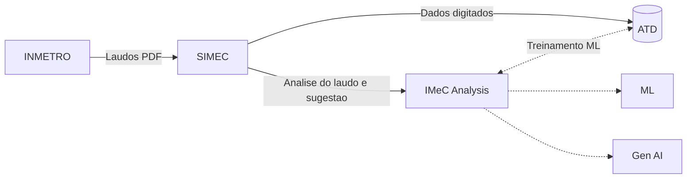

# Faturamento - Cobrança: Experimentação

#  IMeC Analysis
Inspeção de Medidor de Consumo baseado em laudos analíticos do INMETRO.

### Proposta e execução
> Thiago de Souza Vieira <br>
> Thiago Rodrigues e Rodrigues

## Objetivo
Automatizar a análise de laudos técnicos de aferição (disponibilizados via link como imagem/PDF), permitindo que um modelo de Inteligência Artificial classifique o resultado dentro de opções pré-definidas e cadastradas no sistema. 

O valor gerado está diretamente associado ao aumento da assertividade nos resultados de aferição reportados, potencializando a precisão no cálculo da recuperação de consumo automatizado. 

Registros incorretos desses resultados expõem a operação ao risco de validação de cálculos com critérios inadequados, além de demandarem retrabalho para ajustes, impactando negativamente a eficiência operacional e a confiabilidade do processo.

## Preparação de dados para treino

O pacote [src/machine_learning](src/machine_learning) agora separa duas etapas:

- [src/machine_learning/feature_engineering.py](src/machine_learning/feature_engineering.py): perfilamento do dataset e recomendações heurísticas de colunas.
- [src/machine_learning/data_preparation.py](src/machine_learning/data_preparation.py): limpeza, imputação, encoding, scaling, redução de dimensionalidade e persistência dos artefatos de pré-processamento.

Exemplo de execução local:

```powershell
python src/machine_learning/feature_engineering.py
python src/machine_learning/data_preparation.py
```

Saídas geradas em [model](model):

- pipeline de pré-processamento serializado
- metadata com colunas removidas e configuração aplicada
- dataset preparado para treinamento
- encoder do target, quando necessário


