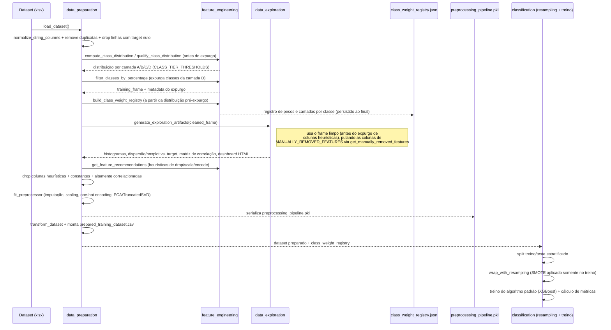
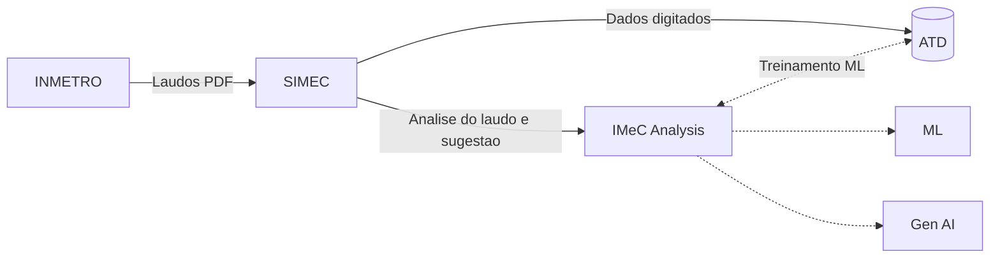

# Faturamento - Cobrança: Experimentação

#  IMeC Analysis
Inspeção de Medidor de Consumo baseado em laudos analíticos do INMETRO.

### Proposta e execução
> Thiago de Souza Vieira <br>
> Thiago Rodrigues e Rodrigues

## Objetivo
Automatizar a análise de laudos técnicos de aferição (disponibilizados via link como imagem/PDF), permitindo que um modelo de Inteligência Artificial classifique o resultado dentro de opções pré-definidas e cadastradas no sistema. 

O valor gerado está diretamente associado ao aumento da assertividade nos resultados de aferição reportados, potencializando a precisão no cálculo da recuperação de consumo automatizado. 

Registros incorretos desses resultados expõem a operação ao risco de validação de cálculos com critérios inadequados, além de demandarem retrabalho para ajustes, impactando negativamente a eficiência operacional e a confiabilidade do processo.

## Preparação e classificação

O pacote [src/machine_learning](src/machine_learning) agora separa três etapas:

- [src/machine_learning/feature_engineering.py](src/machine_learning/feature_engineering.py): perfilamento do dataset e recomendações heurísticas de colunas.
- [src/machine_learning/data_preparation.py](src/machine_learning/data_preparation.py): limpeza, imputação, encoding, scaling, redução de dimensionalidade e persistência dos artefatos de pré-processamento.
- [src/machine_learning/classification](src/machine_learning/classification): treino do classificador padrão do pipeline — **XGBoost** (com resampling/SMOTE, ver seção abaixo) — com cálculo e consolidação de métricas. CatBoost, k-NN e SVM continuam implementados em [`models.py`](src/machine_learning/classification/models.py) (`build_classifier_registry`) e disponíveis para uso experimental/comparativo, mas ficam fora do fluxo padrão (`DEFAULT_CLASSIFIER_ORDER`); podem ser reativados informando `algorithm_order` em `ClassificationConfig`.

Durante a preparação, o pipeline também gera artefatos de data exploration em [model/exploration](model/exploration):

- histogramas das features numéricas em PNG e HTML
- gráficos de dispersão ou distribuição por target em PNG e HTML
- matriz de correlação em PNG e HTML
- metadata JSON com colunas consideradas e arquivos emitidos

### Linha de comando (`src/main.py`)

Ponto de entrada unificado — execute a partir da raiz do repositório:

```powershell
# Ajuda
python main.py --help
python src/main.py --help

# API FastAPI (padrão, sem argumentos)
python main.py
python src/main.py
python main.py --api
python src/main.py --api

# Gera/renova certificado HTTPS local (development)
python scripts/generate_dev_https_cert.py --force

# API FastAPI via HTTPS (porta segura padrão: 8443)
python main.py --api --https --ssl-certfile certs/server.crt --ssl-keyfile certs/server.key --no-reload
python src/main.py --api --https --ssl-certfile certs/server.crt --ssl-keyfile certs/server.key --no-reload

# Pipeline de preparação + exploração + classificação
python src/main.py --ml
```

| Comando | Efeito |
|---|---|
| `python main.py` | Atalho na raiz para iniciar a API (equivalente a `python src/main.py`) |
| `python src/main.py` | Sobe a API em `http://0.0.0.0:8000` (Swagger: `/docs`) |
| `python main.py --api --https --ssl-certfile certs/server.crt --ssl-keyfile certs/server.key --no-reload` | Atalho HTTPS na raiz usando os certificados em `certs/` |
| `python scripts/generate_dev_https_cert.py --force` | Gera/renova certificado autoassinado local em `certs/server.crt` e `certs/server.key` |
| `python src/main.py --api --https --ssl-certfile certs/server.crt --ssl-keyfile certs/server.key --no-reload` | Sobe a API em `https://0.0.0.0:8443` (ou porta definida em `--port`) |
| `python src/main.py --api` | Idem ao padrão |
| `python src/main.py --ml` | Roda preparação, exploração gráfica, treino e consolidação de métricas |

Parâmetros úteis do script de certificado:

- `--output-dir certs`: diretório de saída dos arquivos PEM.
- `--cert-file server.crt`: nome do arquivo do certificado.
- `--key-file server.key`: nome do arquivo da chave privada.
- `--common-name localhost`: CN/SAN DNS principal para uso local.
- `--days 365`: validade do certificado em dias.
- `--force`: sobrescreve arquivos existentes (renovação).

Execução HTTPS por diretório (evita erro de caminho):

- Na raiz do repositório: `python src/main.py --api --https --ssl-certfile certs/server.crt --ssl-keyfile certs/server.key --port 8443 --no-reload`
- Dentro de `src`: `python main.py --api --https --ssl-certfile ../certs/server.crt --ssl-keyfile ../certs/server.key --port 8443 --no-reload`

Observação: se os arquivos estiverem em `certs/`, também funciona informar apenas `server.crt` e `server.key`; a aplicação tenta resolver automaticamente em `./certs`.

Alternativa para iniciar a API via Uvicorn (evita problemas de import em ambientes onde `src` não está no `PYTHONPATH`):

```powershell
python -m uvicorn --app-dir src api.main:app --host 0.0.0.0 --port 8000 --reload

# HTTPS
python -m uvicorn --app-dir src api.main:app --host 0.0.0.0 --port 8443 --reload --ssl-certfile .\certs\server.crt --ssl-keyfile .\certs\server.key
```

Acesso no navegador:

- Swagger UI: http://localhost:8000/docs
- ReDoc: http://localhost:8000/redoc
- OpenAPI JSON: http://localhost:8000/openapi.json

Com HTTPS:

- Swagger UI: https://localhost:8443/docs
- ReDoc: https://localhost:8443/redoc
- OpenAPI JSON: https://localhost:8443/openapi.json

Com `--ml`, o fluxo gera o dashboard HTML em [model/exploration](model/exploration), treina o algoritmo padrão (XGBoost + SMOTE) e persiste o consolidado em [model/classification](model/classification).

Scripts individuais (opcional, fora do entrypoint):

```powershell
python src/machine_learning/feature_engineering.py
python src/machine_learning/data_preparation.py
```

Instalação das dependências:

```powershell
python -m pip install -r requirements.txt
```

Saídas geradas em [model](model):

- pipeline de pré-processamento serializado
- metadata com colunas removidas e configuração aplicada
- dataset preparado para treinamento
- encoder do target, quando necessário
- resumo consolidado das métricas de classificação em CSV
- detalhes da avaliação por algoritmo em JSON

### Fluxo de preparação e exploração de dados

Visão sintética da ordem real das etapas — do dataset bruto (`.xlsx`) até os artefatos persistidos em [model](model) e [model/exploration](model/exploration):



### Qualificação de classes (`model/class_weight_registry.json`)

Artefato persistido junto aos demais outputs de [model](model) (não é descartável como o conteúdo de [model/exploration](model/exploration)): classifica cada classe do target `CODRSTAFER` em uma camada de representatividade — **A**, **B**, **C** ou **D** — e registra, por classe retida, contagem, percentual sobre o total de linhas e peso balanceado (`weight`, mesma fórmula do `class_weight="balanced"` do scikit-learn). Os limiares percentuais que definem cada camada vêm de uma única fonte, `CLASS_TIER_THRESHOLDS` em [src/machine_learning/feature_engineering.py](src/machine_learning/feature_engineering.py). Classes da camada **D** (cauda estatística, sem volume suficiente para qualquer técnica de modelagem/augmentation) são descartadas do treino. O registro serve tanto para auditoria do expurgo quanto como insumo futuro para uma narrativa via LLM sobre a confiabilidade esperada da predição, com base na camada/peso da classe prevista.

### Features removidas manualmente

A lista de colunas descartadas por análise manual/domínio de negócio (ruído, redundância ou baixo valor preditivo) é centralizada em `MANUALLY_REMOVED_FEATURES`, em [src/machine_learning/feature_engineering.py](src/machine_learning/feature_engineering.py). Essa mesma lista é reaproveitada em dois pontos do pipeline: no drop de colunas antes do fit do pipeline de pré-processamento (`data_preparation.py`) e na exploração gráfica (`data_exploration.py`, via `get_manually_removed_features`), para não gerar histogramas/dispersão dessas colunas.

```text
VLRENS_CGA_NMN, VLRENS_CGA_CPC, RESPAFER, CODPRSERV,
VLRDVI_ELM_A, VLRDVI_ELM_B, VLRDVI_ELM_C, FTRCRC_CGA_NMN_ELM,
TPRIFR, TPRSUP, FTRCRC_CGA_NMN_ELM_1, TPRIFR_1, TPRSUP_1,
CODPRJ, ENSAIO_LAUDO_CORR, INDRST_ENS_COR, INDRST_ENS_TNS,
ENSAIO_LAUDO_MESA, ENSAIO_LAUDO_TEMPERATURA, ENSAIO_LAUDO_TEMPERATURA2,
IND_LAUDO_EXTERNO, VLRENS_CGA_CPC_1, VLRDVI_ELM_B_1, VLRDVI_ELM_C_1,
INDRST_ENS_COR_1, INDRST_ENS_TNS_1, VLRLTR_MAN_KWH, VLRLTR_MAN_KVARH,
VLR_LTR_MAN_KVARH, SEQ_NUMLAUDO
```

### Data augmentation (SMOTE)

Classes minoritárias (camadas B/C) passam por oversampling via **SMOTE** (biblioteca `imbalanced-learn`), aplicado **somente ao conjunto de treino** — nunca ao teste — em [src/machine_learning/classification/resampling.py](src/machine_learning/classification/resampling.py) (`wrap_with_resampling`), que encapsula o estimador em um `Pipeline` do `imbalanced-learn`: o resampling só roda dentro de `.fit()`, mantendo `.predict()`/`.predict_proba()` intocados. Essa separação treino/teste é uma das principais distinções deste pipeline.

### Etapas padrão de preparação

Completam o pipeline, sem maiores detalhes por ora: limpeza/normalização de strings, remoção de duplicatas, imputação de nulos, encoding de categóricas (one-hot), padronização/scaling de numéricas, redução de dimensionalidade (PCA ou TruncatedSVD, conforme densidade dos dados) e split treino/teste estratificado.


